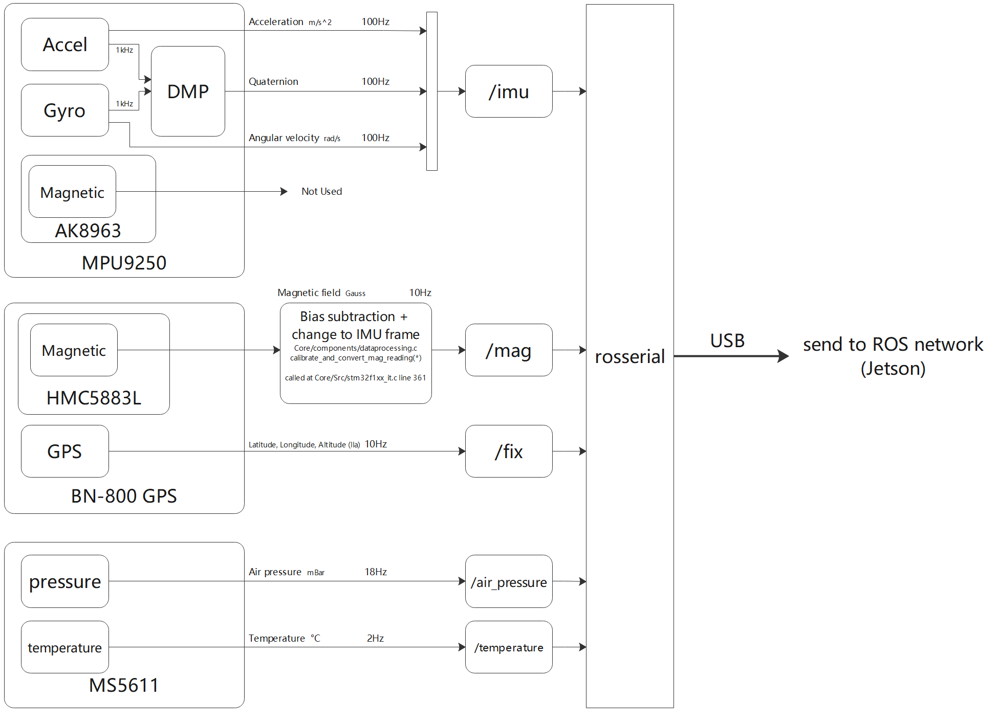
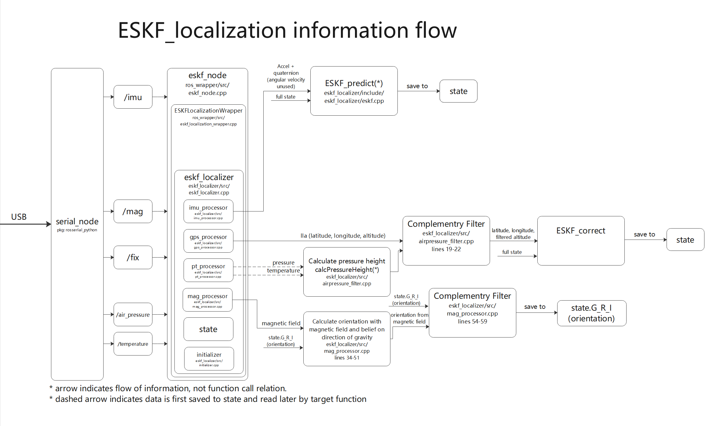

# eskf_localization

## Description
ROS implementation of the Error State Kalman Filter according to *Quaternion kinematics for the error-state Kalman filter* by Joan Solà. 
Full text can be obtained [here](https://arxiv.org/abs/1711.02508).

Node fuses information from IMU, GPS, magnetometer, air pressure and temperature. publishes fused pose, fused path and fused fix(latitude, longitude, altitude).

This branch is the ROS side code for processing information from my [XIMU module](https://github.com/infinity1096/XIMU/tree/ROS-Filtering), a 10 axis ROS-compatible sensor module.

Picture of XIMU module:


## Frames and transformations

Color corrospondence: Red - X, Green - Y, Blue - Z
### IMU Frame(I)

### Gps Frame(Gps)


### Magnetometer frame
Raw data is processed by XIMU such that the magnetic field is in IMU frame. 

### Global Frame(G)
Global Frame is a ENU frame centered at lla_origin, where lla_origin is the latitude, longitude, and altitude during initialization.

### Transformations


## Information flow

### XIMU information flow

### ESKF_localization information flow



For more details on the ESKF filter, consult: https://zhuanlan.zhihu.com/c_1266722926339645440

## Usage
To receive information from XIMU, we need the rosserial node. install rosserial package and run the node:
```
rosrun rosserial_python serial_node.py _port:=/dev/ttyACM0 _baud:=250000
```
The port may differ on different computers. Since the XIMU send data via VCP(Virtual COM Port), the baud rate can be arbitrary.
```
roslaunch eskf_localization eskf_localization.launch
```
## Reference
- https://zhuanlan.zhihu.com/p/152662055
- dataset: https://epan-utbm.github.io/utbm_robocar_dataset/
  - recommended: https://drive.utbm.fr/s/MR7DdRcWYysk9Do/download
